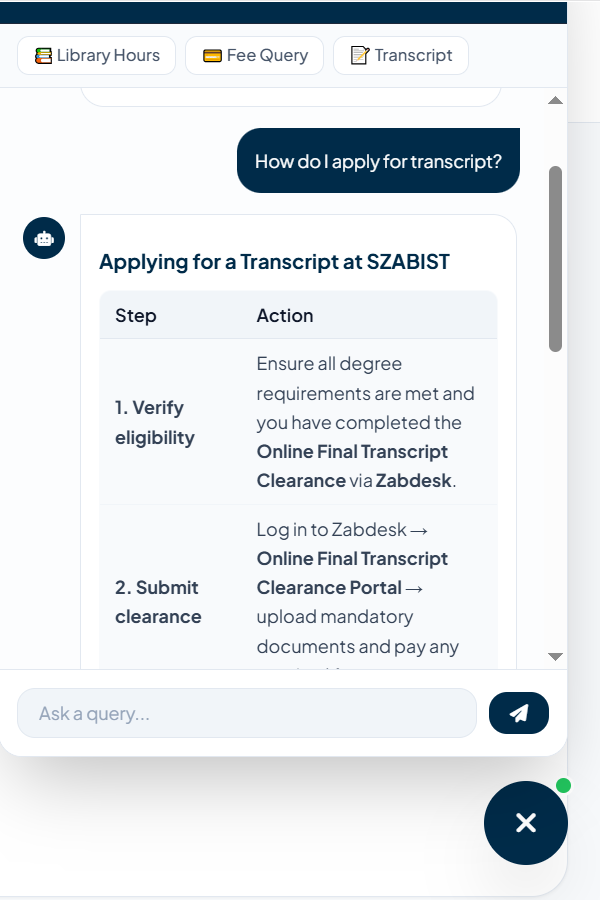
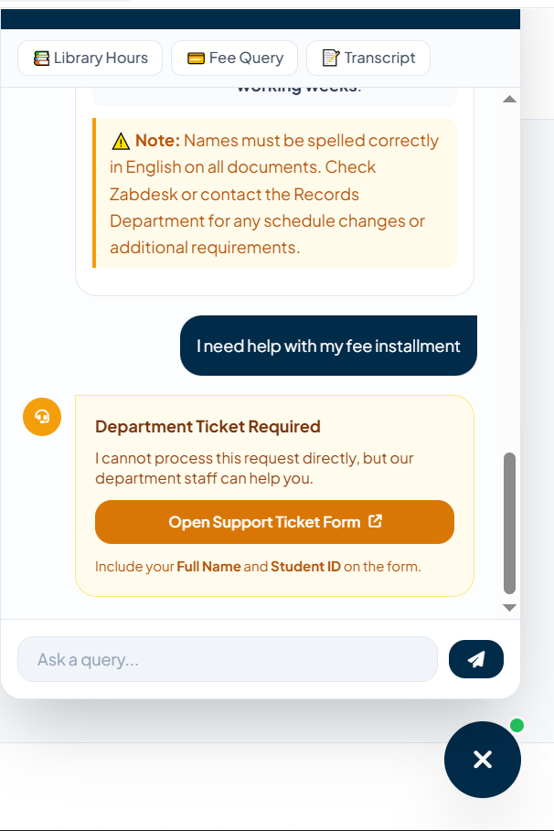
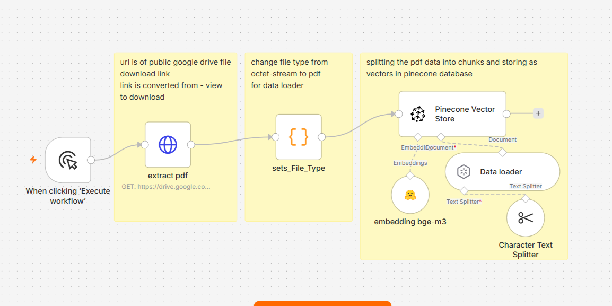
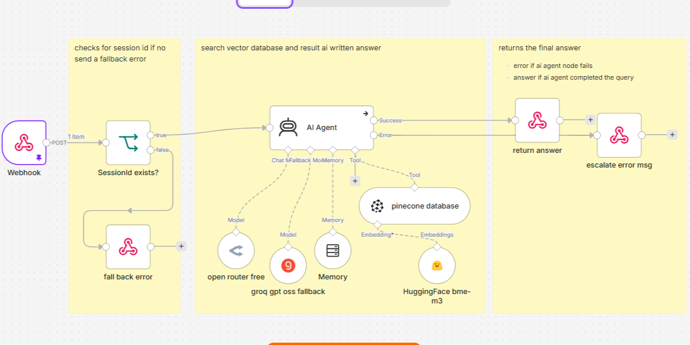
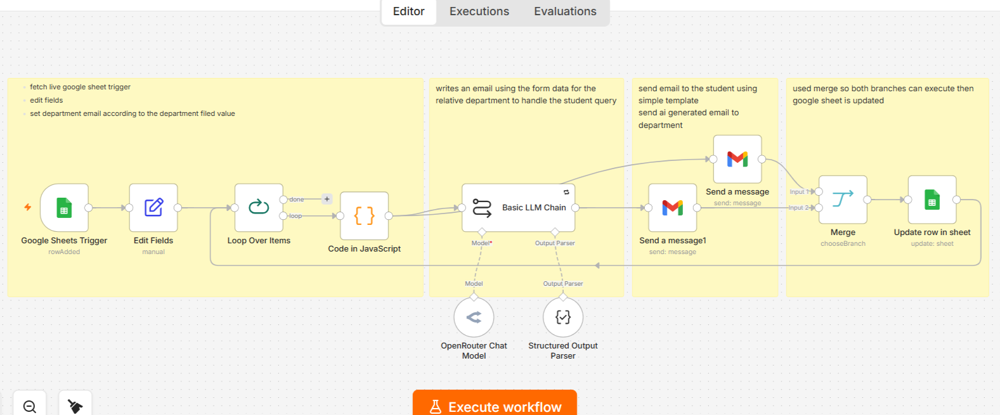

# University AI Student Support System

An event-driven, MVP / production-oriented architecture RAG chatbot and automated ticket dispatch system. Built with **n8n**, **OpenRouter**, **Pinecone**, and modular **JavaScript**, this system provides instant AI answers for general academic/campus inquiries while deterministically escalating complex administrative requests to department staff via structured ticket dispatching.

---

## 💻 System Architecture

The project consists of a lightweight, modular frontend and a 3-part backend orchestration pipeline in n8n.

```text
[ Student Chat Widget ] ──(Webhook)──► [ Workflow 2: AI Chat Agent ] ──► [ Pinecone Vector DB ]
                                                 │
                                                 ├── (General Q&A) ──► Returns Response
                                                 │
                                                 └── (Escalation)  ──► [ Google Form Submission ]
                                                                                │
                                                                                ▼
[ Google Sheets Logging ] ◄── (Update Row) ── [ Workflow 3: Ticket Dispatch ]
           │                                            │
           └── (Auto-Generates Ticket ID)               ├──► Email to Department Staff
                                                        └──► Confirmation Email to Student

```

---
| Chatbot RAG Answer | Ticket Escalation Card |
| :---: | :---: |
|  |  |

## ✨ Key Engineering Highlights

* **Structured LLM-based intent routing:** Utilizes a zero-temperature LLM configuration (`temperature: 0`) and hardened system prompts to enforce strict separation between general public queries (answered via RAG) and actionable administrative requests (escalated to humans).
* **Row-derived Ticket ID generation:** Integrates an `ARRAYFORMULA` in Google Sheets to assign unique sequential `Ticket ID`s dynamically upon form submission, preventing race conditions if multiple students submit forms simultaneously.
* **Decoupled Security Pattern:** Implements the `config.example.js` / `config.js` design pattern combined with `.gitignore` to prevent credential exposure in public repositories.
* **Modular Frontend Architecture:** Built with clean separation of concerns (`index.html` structure, `script.js` application logic, and `config.js` settings) featuring real-time Markdown rendering via Marked.js.

---

## 🛠️ Repository Structure

```text
.
├── assets/                  # Images and GIFs for README documentation
│   ├── chat-demo.png
│   ├── escalation-card.png
│   ├── workflow-1-ingestion.png
│   ├── workflow-2-agent.png
│   └── workflow-3-dispatch.png
├── index.html               # Main user interface & chat widget structure
├── script.js                # Application logic, async requests & DOM rendering
├── config.example.js        # Environment template for endpoints (Tracked by Git)
├── config.js                # Local API endpoints & secret keys (Ignored by Git)
├── .gitignore               # Git protection rules to prevent credential leaks
├── README.md                # System documentation
└── n8n-workflows/           # Exported backend n8n orchestration pipelines
    ├── 1-knowledge-base-ingestion.json
    ├── 2-ai-chat-agent.json
    └── 3-ticket-dispatch-system.json

```

---

## 🔄 Backend Workflows (`/n8n-workflows/`)

### 1. Knowledge Base Ingestion (`1-knowledge-base-ingestion.json`)


* **Purpose:** Parses university documentation (PDFs, policies, FAQs), generates text embeddings, and indexes them into Pinecone.
* **Key Nodes:** Read Binary Files, Text Splitter, OpenRouter / OpenAI Embeddings, Pinecone Vector Store.

### 2. AI Chat Agent (`2-ai-chat-agent.json`)


* **Purpose:** Acts as the backend for the frontend widget. Handles CORS, retrieves vector context, evaluates student intent, and formats response payloads.
* **Key Nodes:** Webhook Trigger, Pinecone Vector Store (Retriever), OpenRouter / Basic LLM Chain, Respond to Webhook (JSON & CORS header configuration).

### 3. Ticket Dispatch System (`3-ticket-dispatch-system.json`)


* **Purpose:** Triggers when an escalated Google Form is submitted. Iterates over submission items, dispatches departmental emails, generates confirmation receipts for students, and updates Google Sheets with audit statuses.
* **Key Nodes:** Google Sheets Trigger, Loop Over Items, Code Node (Branch Routing), Gmail (Department & Student Receipts), Google Sheets Update Row.

---

## 🚀 Setup & Installation

### 1. Frontend Configuration

1. Clone the repository:
```bash
git clone https://github.com/tariq-bawany/University-AI-Student-Support-System.git
cd university-ai-student-support

```


2. Create your local config file from the template:
```bash
cp config.example.js config.js

```


3. Open `config.js` and set your active endpoints:
```javascript
const CONFIG = {
    N8N_WEBHOOK_URL: "https://your-n8n-instance.cloud/webhook/your-agent-endpoint",
    FORM_URL: "https://forms.gle/your-google-form-id"
};

```


### 2. n8n Workflows Import

1. Open your n8n instance and navigate to **Workflows**.
2. Select **Import from File** and upload each workflow from the `n8n-workflows/` directory.
3. Configure your credentials for **Pinecone**, **OpenRouter/OpenAI**, **Gmail**, and **Google Sheets**.
4. Set the **Webhook Trigger** in Workflow 2 to respond `Using 'Respond to Webhook' Node`.

### 3. Google Sheets Setup (Ticket ID Formula)

To enable automated ticket ID assignment and prevent concurrency collisions:

1. Open the Google Sheet connected to your escalation form.
2. Add a new column on the far right named `Ticket ID`.
3. In **Cell Row 1** of that column, paste the following formula:
```excel
={"Ticket ID"; ARRAYFORMULA(IF(A2:A<>"", ROW(A2:A), ""))}

```


4. Configure the **Update Row in Sheet** node in Workflow 3 to match rows by **Key Column** set to `Ticket ID`.

## ⚠️ Current MVP Limitations

This project is an educational MVP built to explore RAG,
LLM-based routing, and n8n workflow automation.

It is not intended for direct production deployment.

Current limitations include:

- No student authentication
- No persistent conversation database
- LLM-based intent classification may misclassify edge cases
- Google Sheets is used as the ticket audit layer
- No formal RAG evaluation benchmark
- No production monitoring or observability
- No enterprise access-control layer
